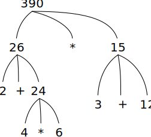

# 1.1.3 计算运算符组合

[Original](https://sourceacademy.org/sicpjs/1.1.3)

**TODO:** 好多翻不出来, 需要重新 review

本章我们的目的是to isolate issues about thinking procedurally. 

要计算运算符组合, 首先执行以下操作:

1. 评估运算元表达式的组合


尽管规则十分简单, 但是也体现了通用过程的重要之处. First, observe that the first step dictates that in order to accomplish the evaluation process for a combination we must first perform the evaluation process on each operand of the combination. 其次, 计算规则本质上是 _递归_ 的, 简单来说就是需要调用自己.

递归的概念能够很简洁地表达相应的含义, 在嵌套很深的组合中, 会被看做是一个复杂步骤. 比如计算如下表达式:

```js
(2 + 4 * 6) * (3 + 12); 
```

以上表达式要求计算规则应用于四种不同组合中. 我们可以用一张图表, 树的形式来呈现这些组合, 如下图. 



每个组合都由一个包含分支的节点来表示, 同时每个分支又由运算符和对应的运算元构成. 终末节点(也就是没有分支的节点)要么是运算符, 要么是数字. 从树的角度观察这些计算过程, 我们从终末节点开始进行一步一步向上计算. 通常情况下, 递归是一个很有用的处理包含层级, 树状的对象. 事实上, "percolate values upward" 形式的计算规则是一种常用的计算形式, 被称为 _tree accumulation_.

接下来, 我们开始观察第一步的重复应用

重点要注意的一点是在决定表达式中名称的含义时, 环境起着重要作用. 在类似 JavaScript 的交互型语言中, 对于 `x + 1` 这样的表达式, 不提前声明环境而去讨论表达式的值是完全没有意义的, 因为没有声明环境我们也就无法知道 `x` 的值. 在第三章中我们会看到, 环境的含义, 就是计算过程执行的上下文, 理解环境对我们理解程序的执行有很重要的意义.

注意以上提到的计算规则并没有处理声明. 比如, 计算 `const x = 3;` 并不是将 `=` 运算符应用到两个参数中, 其中一个参数是 `x`, 另一个是 `3`, 不能这样理解这个声明. 实际上这个声明的含义是将 `x` 变量与值 `3` 关联. (也就是说, `const x = 3;` 并不是一项表达式组合.)

`const` 在 JavaScript 中是 __关键词__ (_keyword_). 关键词有特殊含义, 因此不能作为变量名称. 关键词和声明中关键词的组合会告诉 JavaScript 解释器, 用特殊的方式处理这类声明. 每一个这类**句法**(_syntactic_)形式都有各自的计算规则. 不同种类的声明和表达式(以及所关联的计算规则), 构成了编程语言的语法.

