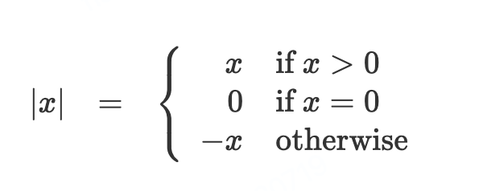

# 1.1.6 条件表达式和断言

[Original](https://sourceacademy.org/sicpjs/1.1.6)

截止目前, 我们能够实现的函数的表达能力还是有所欠缺, 因为我们没有办法根据测试的结果对测试的示例进行不同的操作. For instance, we cannot declare a function that computes the absolute value of a number by testing whether the number is nonnegative and taking different actions in each case according to the rule


以上结构是个 _示例分析_, 用 JavaScript _条件表达式_ 表达就是这样:

```js
function abs(x) {
    return x >= 0 ? x : - x;
}
```

用自然语言来描述就是这样的: 如果 x 大于或等于 0, 就返回 `x` 本身, 否则返回 `-x`. 通用的形式是这样的:

predicate ? consequent-expression : alternative-expression

条件表达式以断言(_predicate_)作为起始, 也就是, 表达式的结果要么是 `true` 要么是 `false`, 也就是 JavaScript 中的两个布尔值. 原始布尔表达式 `true` 或者 `false` trivially evaluate to the boolean values true and false, respectively. 断言 (_predicate_) 之后是一个问号, 然后是作为结果的表达式(_consequent-expression_), 最后是另一个作为结果的表达式(_alternative-expression_).

要计算条件表达式, 解释器会首先计算出断言的结果. 如果断言结果为 `true`, 那么解释器就会返回 _consequent-expression_, 否则就是 _alternative-expression_.

**断言**(_predicate_)被用于返回布尔值的操作符和表达式中, 布尔值也可以被返回布尔值的表达式所替代. 以上示例的计算绝对值函数 `abs` 中, 使用了 `>=` 操作符, 该操作符接受两个数字作为参数, 然后测试第一个数字是否大于或者等于第二个数字, 根据对应的计算结果返回对应值.

如果想要单独分开处理值为0的情况, 我们可以这样实现对应的函数:



在 JavaScript 中, 可以使用嵌套条件表达式的方式来表达:

```js
function abs(x) {
    return x > 0
           ? x
           : x === 0
           ? 0
           : - x;
}
```

在替代表达式 (_alternative expression_) `x === 0 ? 0 : - x` 中, 括号并不是必须的, 因为条件表达式的语法结构是右联合的, 即会先计算右侧的表达式. 解释器会忽略空格和换行, 在这里加入是为了对齐 `?` 和 `:`, 以增加可读性. 以上示例的通用形式是这样的:


我们把断言 p<sub>i</sub> 和之后的表达式 e<sub>i</sub> 叫做一个 _分句_. 以上的示例可以看作是一系列的分句, 最后是替代表达式. 根据条件表达式的计算, 以上示例分析的最终结果是这样计算出来的, 首先计算断言 p<sub>1</sub>, 如果值是 `false`, 那么就计算 p<sub>2</sub>, 如果值依然是 `false`, 则计算 p<sub>3</sub>. 这个过程需要一直持续到发现某个断言的值为 `true`, 最终的值就是最后的替代表达式的值.

除了原始断言 `>=`, `>`, `<`, `<=`, `===`, 以及 `!==` 能够作用于数字之外, 还有一些逻辑组合操作, 我们能够借此实现组合断言. 其中3个最常用的是:

- expression<sub>1</sub> && expression<sub>2</sub>
  
  该操作表达**逻辑联合**(_logical conjunction_), 与自然语言中的 "和" 含义类似. 以上句法形式是
	
	 expression<sub>1</sub> ? expression<sub>2</sub> : false 的语法糖
- expression<sub>1</sub> || expression<sub>2</sub>
	
	该操作表达**逻辑分离**(_logical disjunction_), 与自然语言中的 "或" 含义类似. 以上句法形式是 
	
	expression<sub>1</sub> ? true: expression<sub>2</sub> 的语法糖

- ! expression

	该操作表达**逻辑否定**(_logical negation_), 与自然语言中的 "非" 含义类似. 当 `expression` 的值为 false 时, `! expression` 的值为 true.

注意 `&&` 和 `||` 都是句法形式, 而非操作符; 它们右侧的表达式并不一定始终会被计算. 不过操作符 `!` 依然遵循 [1.1.3](1.1.3.evaluating-operator-combinations.md) 中所描述的计算规则. 这是一个一元运算符, 说明只接受一个参数. 截止目前我们提到的算术操作符都是二元操作符, 包括上面的原始断言, 都是接受两个参数. 操作符 `!` 之后跟的是相关参数, 因此我们把它叫做 **前置操作符** (_prefix operator_). 另外一个前置操作符是负号操作符. 在 `abs` 函数中我们接触过这个表达式: `-x`.

如果需要一个示例来说明断言的使用方式, 可以使用 `5 < x < 10`, 这个表达式可以用这种形式来表达:

```js
x > 5 && x < 10
```

句法形式 `&&` 的优先级低于比较操作符 `<` 和 `>`, 条件表达式的句法形式 `...?...:...` 优先级低于截止目前我们遇到过的所有其他操作符. 我们在函数 `abs` 中用到过这个句法形式.

接下来是另一个示例, 我们定义一个断言来比较两个数字的大小:

```js
function greater_or_equal(x, y) {
    return x > y || x === y;
}
```

也可以这样描述:

```js 
function greater_or_equal(x, y) {
    return ! (x < y);
}
```

函数 `greater_or_equal`, 作用于两个数字时, 其行为和操作符 `>=` 一致. 一元操作符的优先级高于二元操作符, 因此示例中我们加上了括号.

