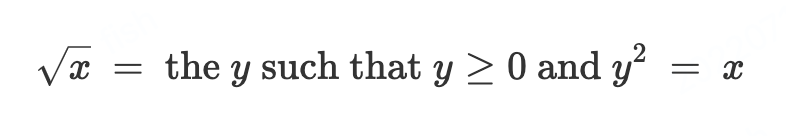
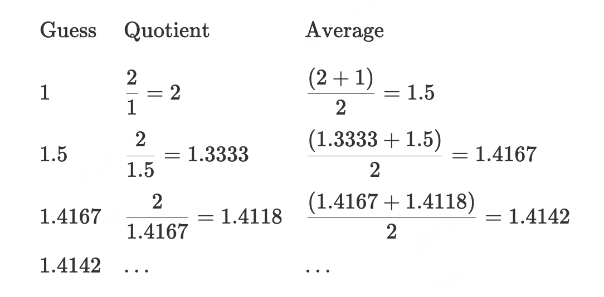

# 1.1.7 示例: 牛顿法实现平方根

Not Done

[Original](https://sourceacademy.org/sicpjs/1.1.7)

前几章所介绍的函数, 跟普通的数学运算很相似. 声明一个值, 该值的最终结果由一个或多个参数决定. 不过数学函数和计算机函数有个很关键的区别, 计算机函数必须更高效.

查看示例, 考虑一个计算平方根的问题. 我们可以这样定义平方根函数:



以上描述了一个完全合法的数学函数. 我们可以用这个函数来计算某个数是否是另一个数的平方根, or to derive facts about square roots in general. 另一方面, 以上定义并不是一个计算机函数. 事实上, 这个方法一点都不曾提及如何找到某个数字的平方根. It will not help matters to rephrase this definition in pseudo-JavaScript:

```js
function sqrt(x) {
	return the y with y >= 0 && square(y) === x;
}
```

这又引发了一个问题.

数学函数和计算机函数的差异相当于描述事物属性和描述怎么做某件事的差异, 也相当于声明式语句和命令式语句的区别. 在数学领域中使用的通常是声明式的描述, 而在计算机领域中则常用命令式的描述.

那么我们如何去计算平方根呢? 最常用的方式是使用牛顿法计算渐进式的结果, 也就是说无论何时我们猜测 `y` 是数字 `x` 的平方根值, we can perform a simple manipulation to get a better guess (one closer to the actual square root) by averaging yy with x/yx/y.2 For example, we can compute the square root of 2 as follows. Suppose our initial guess is 1:



不断延续这个步骤, 我们就能获取到越来越精确的平方根值.

现在我们开始利用函数对这一过程实现标准化. We start with a value for the radicand (the number whose square root we are trying to compute) and a value for the guess. 如果所猜测的值无限符合我们的要求, 那么我们的计算就完成了, 如果还没有的话, 就再继续重复步骤进行猜测. 用函数呈现就是这样:

```js
function sqrt_iter(guess, x) {
    return is_good_enough(guess, x)
           ? guess
           : sqrt_iter(improve(guess, x), x);
} 
```

我们可以通过计算方根的商数和旧的猜测值的平均值来获取更接近最终结果的值.


```js
function improve(guess, x) {
    return average(guess, x / guess);
}

function average(x, y) {
    return (x + y) / 2;
} 
```